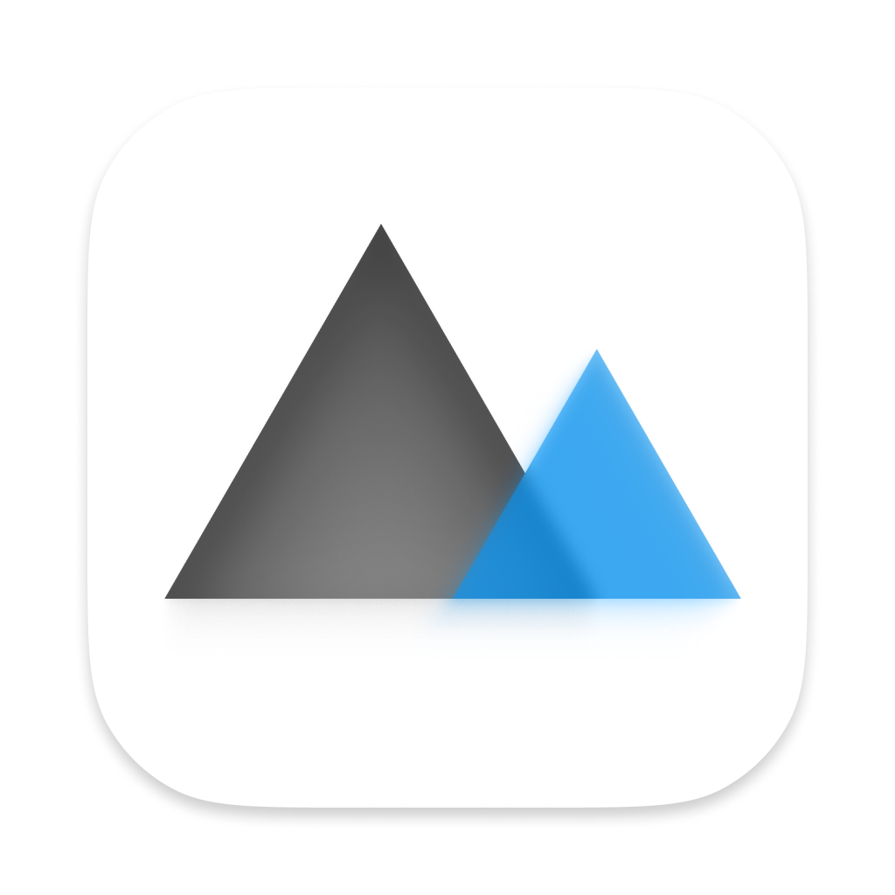

#  每日 Bing 美图下载

[toc]

## 微软必应介绍

Bing 是微软开发的一款搜索引擎，其使用方法与 Google、百度相似，但会在每天更新一章美图作为搜索引擎的壁纸。相较于 Google 更加好看，相较于百度更加干净，因此备受欢迎。近日，微软宣布将大火的 ChatGPT 接入 Bing，进一步完善了 Bing 的功能。

## 每日 Bing 美图下载介绍

该工具本来是为了朋友的软件而开发，开发完成后发现可以打包成独立的 App 造福更多人，于是为其使用 Qt 制作了简易的 UI 后打包成为 macOS App。直接下载 Release 板块中发布的 .dmg 文件后根据指示进行安装即可开始使用。

**因为使用 Python 开发并使用 PyInstaller 打包，该应用打开后会出现图标消失的问题，稍等一会儿即可打开。目前暂时没有找到解决这一问题的办法。**

每日 Bing 美图下载仅打包了 macOS 版本，原生为 Intel 芯片的 macOS 软件，在 Apple Silicon 的 Mac 上可以通过 Rosetta2 转译后运行，暂不支持 Windows 系统，如果您需要 Windows 系统的版本请[点击此处](#1)。

## Windows 版本

因为开发使用的平台为 macOS 平台故没有打包 Windows 版本，如果需要使用 Windows 版本可在 GitHub 中下载源代码后自行编译打包。**注意：保存图片的路径使用的是 macOS 的路径，如果需要移植到 Windows 平台请根据 Windows 文件系统的路径修改相关代码。**
